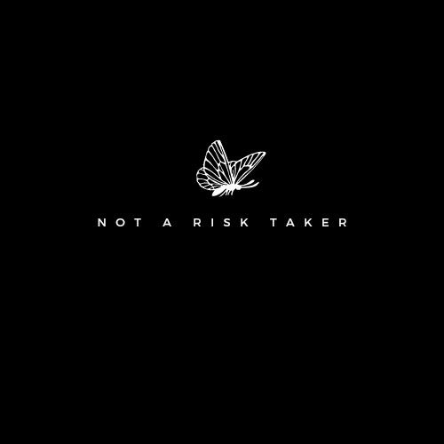
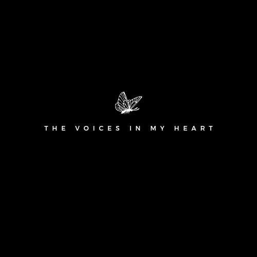

<!DOCTYPE html>
  <head> 
    <meta charset="utf-8"> 
    <meta name="viewport" content="width=device-width, initial-scale=1.0"> 
 
    <!-- Bootstrap CSS --> 
    <link href="https://cdn.jsdelivr.net/npm/bootstrap@5.1.3/dist/css/bootstrap.min.css" rel="stylesheet" integrity="sha384-1BmE4kWBq78iYhFldvKuhfTAU6auU8tT94WrHftjDbrCEXSU1oBoqyl2QvZ6jIW3" crossorigin="anonymous"> 
    <link rel="stylesheet" type="text/css" href="style.css"> 
 
    <title>The Beauty of Unsaid Words</title> 
  <body> 
 
 
    <header> 
 
     
 
      

 
      
 
        <ul> 
        <li><a href ="#home" class="btn btn-home">Home</a></li> 
        <li><a href ="#about" class="btn btn-about">About</a></li> 
        <li><a href ="#feedback" class="btn btn-feedback">Feedback</a></li> 
        <li><a href ="" class="btn btn-post">Post</a></li>    
        </ul> 
        
 
   
    
 
      <h1> The Beauty of Unsaid Words </h1> 
 

  
 
</header> 
 

 
  
 
    
 
       
      <h4><b><i>Not a risk taker</i></b></h4> 
      
 I used to have faith in my abilities and all the things that I know I could achieve. 
         I used to work hard in making progress of all the things that I knew I wasn't good at.   
         It was the younger version of me who wasn't afraid of the consequences of taking risk,   
         but as I grew older and realized how big the world I was living in, I began to get afraid of taking risk. 
          I locked myself in my room, <b>wishing that the days would just passed without me having to make any decision.</b> 
    
         
 <a href=""class="btn btnsend">Read</a> 
    
 
    
 
       
      <h4><b><i> Endless road </i></b></h4> 
      
 I've felt like I only had a goal for other people so many times that I've stopped caring about what I want or what I dream to be. It burdens me to think that I was born simply to meet the goals that those close to me were unable to fulfill. It hurts me to accept the fact that I was a puppet of my own choice, that I let them decide who I should be that's why I am here. 
 I'm not sure what race I'm in anymore; <b> I just keep running on an endless road</b>

 
 <a href=""class="btn btnsend">Read</a> 
    
 
    
 
       
      <h4><b><i> Hindi ka umusad </i></b></h4> 
      
 Nasanay kang tumakbo at magtago. Magpanggap na wala lang ang lahat sayo, kaya nang minsan kang harapin ng mga taong sumira sa buo mong pagkatao,  
        doon mong napagtantong para kang na-engkanto, dahil bumalik ka lang ulit sa umpisa kung saan ka nagsimulang tumakbo. 
 <b>Hindi ka pala talaga umusad.</b>      
 
 
 
 <a href=""class="btn btnsend">Read</a> 
    
 
    
 
       
      <h4><b><i> Hindi ka umusad </i></b></h4> 
      
 Minsan ang paghakbang ay hindi pag-usad, sapagkat madalas ito ang kahulugan ng pagtakbo sa mga bagay na ayaw nating harapin, mga bagay na takot tayong tanggapin. 
        Minsan ang paghakbang ay hindi pagharap sa panibagong yugto ng buhay, madalas ginagawa ito para makalimot at makatakas sa mga desisyon na pinagsisihan. 
         Minsan ang paghakbang ay hindi pag-usad, dahil hangga't ang ibig nitong sabihin ay paglimot at pagtakas,<b> mananatili itong kahulugan ng pagkaduwag.</b> 
 
       
  <a href=""class="btn btnsend">Read</a> 
        
 
  
 

 
 
 
  
 
 
   
      <h2><b>About TBRP</b></h2> 
      <h3><i>The Voices in My Heart</i></h3> 
      
A compilation of my English and Tagalog poetry can be found on this page.
 
      
When I was a senior in high school, I
started writing to convey all I couldn't voice. 
        Writing was my favorite form of expression since it allowed me to scream out emotions I 
        could not else put into words. Writing gives me the courage to carry on with my life, but 
        it has not always been simple. Like everyone else, I've experienced moments of unhappiness. 
        The most heartbreaking part is when I lose interest in the things I once cherished. Though 
        I stopped writing, my heart didn't. As time goes on, I come to realize that I wasn't the 
        only person who found it challenging to convey their thoughts.   
I'm motivated to keep writing because I want my thoughts to serve as a voice for those who are unable to express their emotions.
 
      
<i> " This page was made as a means of encouraging others to make their voices 
        heard because all emotions are valid. " </i>
 
      
 
   
    <!-- End page content --> 
    
 
 
   <!-- Footer --> 
<footer class="footer"> 
  <h5>Visit my social media account: </h5> 
  <li class="socmedia"></li> 
  <li class="socmedia"></li> 
   <li class="socmedia"></li> 
  
 
 
    </body> 
    </html>
